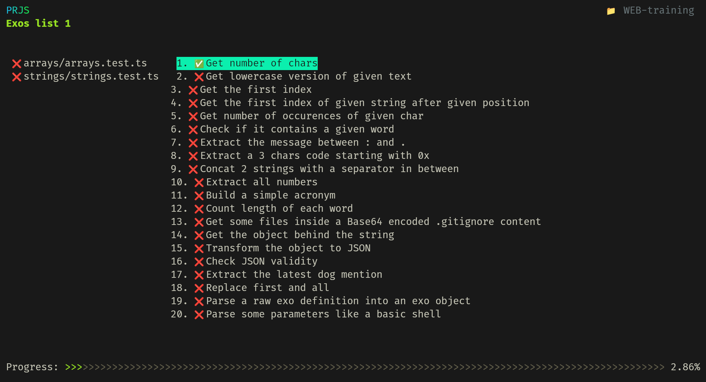

# WEB-training
**Small exos for the HEIG-VD WEB course to train some HTML, CSS and mostly JavaScript. Exos in JavaScript are designed to be ran with [PRJS](https://github.com/samuelroland/prjs) !**

My solutions can be found in the `solution` branch as separated file named `solution.js` or `solution.html`.


Before anything, start by installing NPM dependencies:
```sh
npm install
```
<!-- todo: how to make PRJS work without this step ? -->

## Available exos
Here is the current list of available exos, each exos suite is stored in its dedicated folder:
- `arrays`: ~15 arrays manipulation exos
- `strings`: ~20 strings manipulation exos
- `styling`: a small web page to design in pure CSS

### JS exos
Once you installed PRJS, you can simply run `prjs` and start doing the exos. Type `l`, then select the exos suite with `j` and `k`, go right with `l` and type `enter` to enter the details of an exo. You will see the error and if you start coding and hit Ctrl+S, it should refresh the view. When you are done, you can go the next exo with `n` or go back to the previous with `p`.




<details>
<summary>In case it doesn't work</summary>
Check the PRJS repository README for some known issues !

If it really doesn't work, you can still run the exos with Vitest directly, but the experience will be reduced...

```sh
npx vitest --bail 1
```
The `--bail 1` make the runner stop at first fail so you can see output of failed test one after the other. Vitest run tests in watch mode by default so open your terminal along your IDE so you can see both !


</details>

### Styling
Folder: `styling`  
The goal is to train designing a small web page in pure CSS to train a few concepts like colors, border, backgrounds, margins, padding, placement, basic tags, css selection, ...

<details>
<summary>See more</summary>

Install the Live Server extension in VSCode, open `styling/index.html`, open the live preview and start designing this page:


- TODO: make the page train flexbox and grid
- TODO: make other smaller exos to train CSS styling like a form

</details>
