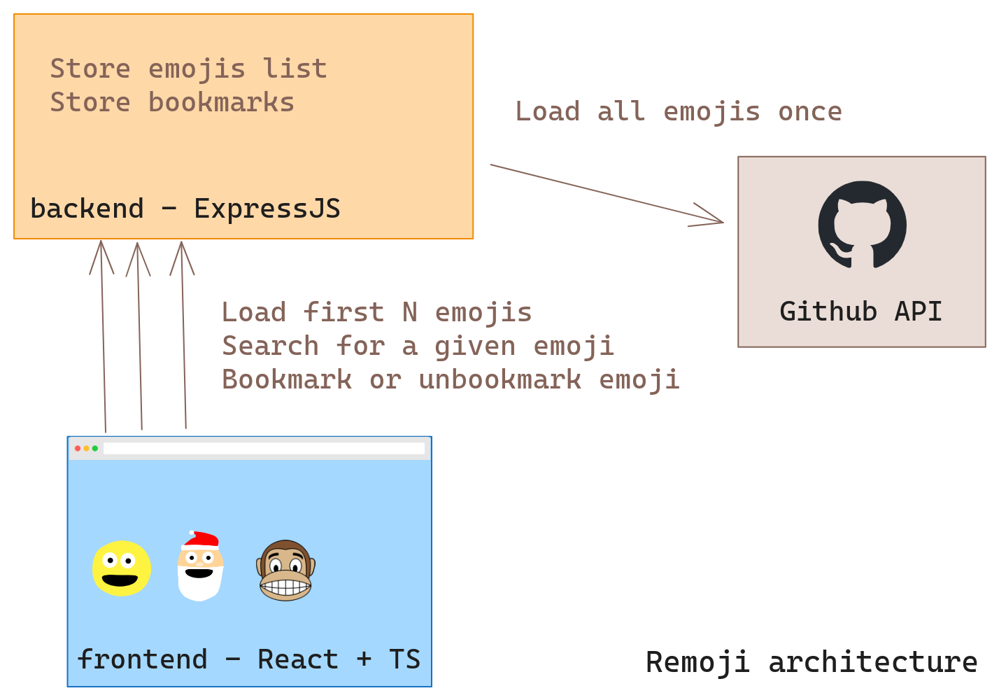

# Remoji - a simple emoji browser

Emoji are fun but they are sometimes hard to find or compare. Let's make a simple emoji browser to easily list, search, copy and bookmark emojis !

## Context
We have:
1. The frontend: a React SPA (Single Page Application) developed in TypeScript
1. The backend: an ExpressJS server in TypeScript too
1. The GitHub API as a source for the emojis

To limit the amount of unecessary requests to the GitHub API (it is rate limited obviously), we will load them all once in the backend when the client ask for it.

**Files tree view**

<!-- TODO: tree output -->

**Final result view**

## Instruction

Implement the following features:
1. When the page loads, the first N it should show the first N emojis and let the user change N (10, 20, 50, 100) with simple buttons. By default, it should be 10.
1. Show bookmarked emojis
1. Bookmark or unbookmark an emoji

We advise you to first read the backend, fix and complete the backend, and then to do the same for the frontend.

Some features are already implemented but contains intentional bugs, it's up to you to find them and fix them...
